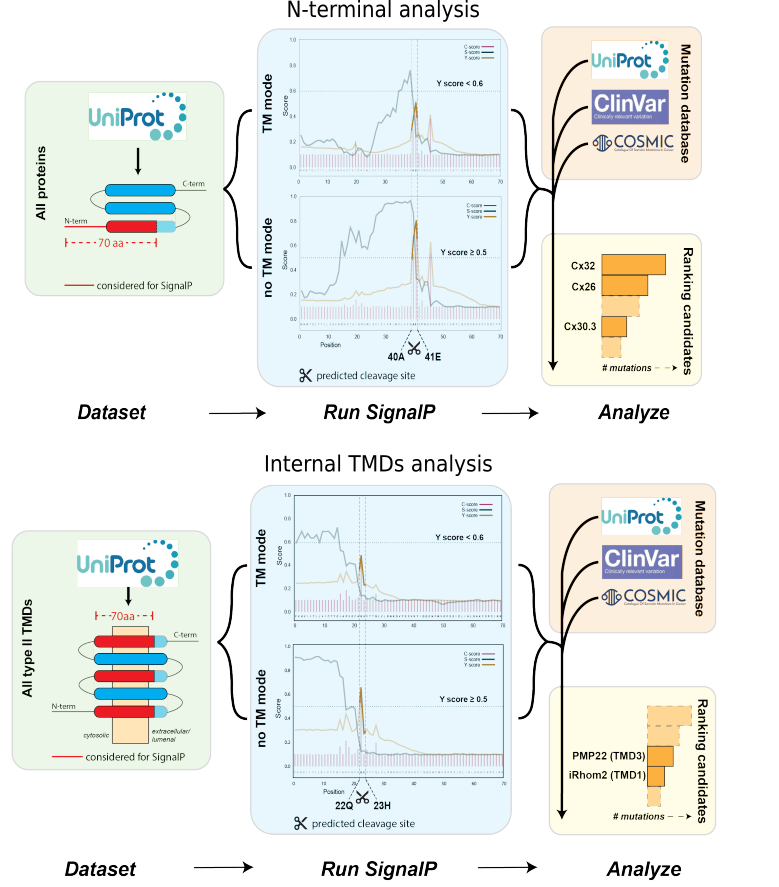

## SPC as a quality control enzyme

---

### Introduction

We performed a computational analysis on the first 70 aa at **the N-t (N-terminal analysis)** of the
whole proteome and on 70 aa windows starting from all **internal TMDs (Internal TMDs analysis)** to
identify **potential SPC cleavage sites** not associated with signal peptides (cryptic cleavage sites) by
using a pre-existing a signal peptide prediction software [SignalP](https://pubmed.ncbi.nlm.nih.gov/21959131/) and comparing the output of two
networks (***no-TM*** and ***TM*** modes). Our hits represent membrane protein with type-II oriented TMD
predicted to be cleaved in ***no-TM network*** mode but not in ***TM network*** mode. Moreover, we rank the hits based on the number
of disease-linked mutations.

Access the Shiny webApp [here](http://shiny.russelllab.org/spc/webApp/)

---

### Computational method
We used the command-line version of the [SignalP4.1](https://services.healthtech.dtu.dk/service.php?SignalP-4.1) program. The program takes a proteins sequence (FASTA formatted) of 70 amino acids length as input and predicts the
cleavage site and reports the Y-score (combined cleavage site score) in its output. To extract
proteins with cryptic cleavage sites, we created two types of peptide sequences by considering the first 70 amino acids of all:
- proteins that lack a canonical signal peptide (**N-terminal analysis**)
- transmembrane domains of proteins that lack a canonical signal peptide (**Internal TMDs analysis**)

We predicted the Y-scores of both types of peptide sequences using the SignalP-TM (***TM network*** mode) and SignalP-noTM (***no-TM network*** mode) version (see Methods for details).
A protein/transmembrane domain was considered to have a non-canonical cleavage site if
its corresponding peptide’s Y-score in the SignalP-TM output was less than 0.6 and in SignalP-noTM output was more than 0.5. We retrieved all
the proteins and their associated feature information from [UniProt/Swiss-Prot](https://pubmed.ncbi.nlm.nih.gov/14681372/).
We assigned mutational information provided in (a)
[UniProt](https://pubmed.ncbi.nlm.nih.gov/14681372/), [COSMIC](https://pubmed.ncbi.nlm.nih.gov/30371878/), and [ClinVAR](https://pubmed.ncbi.nlm.nih.gov/29165669/) databases.

---

### Validation experiments
  Validation of the hits (proteins predicted to have non-canonical cleavage sites) were then performed by ectopically expressing the WT (Wild Type) and mutant constructs in
  WT HEK293T cells or lacking the regulatory SPC subunit SPCS1. Cell lysates were then analyzed
  via Western blot to detect possible SPCS1-dependent cleavage fragments (see Methods for details).

---

### Contents
#### N-terminal analysis
| Location | Description |
| ------ | ----------- |
| data/part_a_fasta | directory with peptide FASTA sequences given as input to SignalP. |
| data/part_a_signalp | output of SignalP peptide sequence prediction. |
| data/part_a_data.tsv | output of SignalP and protein information in TSV format. |

#### Internal TMDs analysis
| Location | Description |
| ------ | ----------- |
| data/part_c_annotations.tsv | Annotations of TM domains in proteins. |
| data/part_a_fasta | directory with peptide FASTA sequences given as input to SignalP. |
| data/part_a_signalp | output of SignalP peptide sequence prediction. |
| data/part_a_data.tsv | output of SignalP and protein information in TSV format. |

#### [webApp](http://spc.russelllab.org)
| Location | Description |
| ------ | ----------- |
| data/server.R | Script to run the Shiny webApp. |
| data/ui.R | Script to run the Shiny webApp. |
| data/workflow* | Workflow figure shown in the REAMDE. |

---

## Contact
  **Gurdeep Singh**: gurdeep.singh@bioquant.uni-heidelberg.de ([Russell lab](russelllab.org), Heidelberg)

  **Andrea Zanotti**: a.zanotti@zmbh.uni-heidelberg.de ([Lemberg lab](https://biochemie-med.uni-koeln.de/en/research/research-groups/lemberg-lab), Heidelberg/Cologne)

  **Matthias Feige**: matthias.feige@tum.de ([CPB lab](https://www.department.ch.tum.de/cell/home/), Munich)
